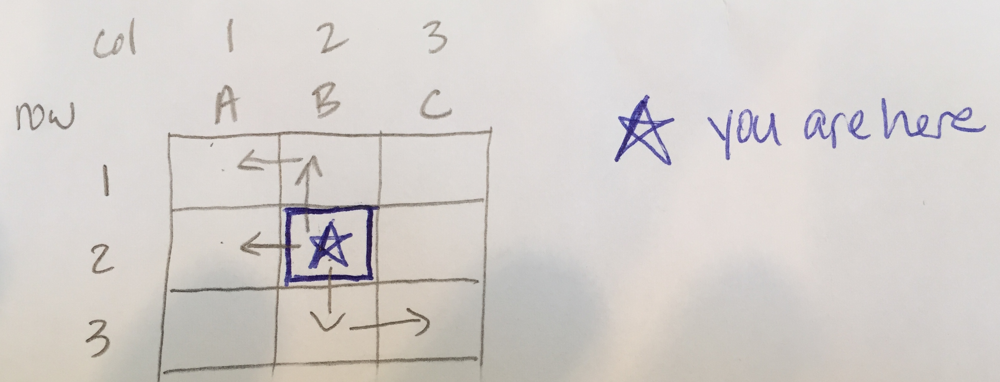

Classes related to cells
================

Reference
---------

Spreadsheet Implementation Technology: Basic and Extensions
Peter Sestoft
<https://mitpress.mit.edu/books/spreadsheet-implementation-technology>

Informal intro to cell references
---------------------------------

1.3 Cell reference formats, p. 3

|     | A1   | R1C1       |
|-----|:-----|:-----------|
| abs | $B$4 | R4C2       |
| rel | B4   | `R[4]C[2]` |

Two main points:

-   A1 vs. R1C1 format (I've said *notation* in the past but will switch to *format*)
-   References can be absolute or relative

Two subtleties the table above glosses over:

-   relative to which cell?
-   a cell reference can be mixed, e.g. relative for the column but absolute for the row

By default, an A1-formatted cell reference is relative. Use a dollar sign `$` to indicate absolute.

By default, an R1C1-formatted cell reference is absolute. Relative references are indicated by putting the offset inside square brackets. Except when the offset if zero, when it is left out. So `RC` is how to say "this cell" -- not `R[0]C[0]`.

We like R1C1 format, especially for relative references, because it is invariant when you copy/move a formula. And it is just more sane, in every possible sense, actually.

Meaning of cell references **assuming found in cell $B$2**

| A1   | R1C1         | Meaning                     |
|:-----|:-------------|:----------------------------|
| A1   | `R[-1]C[-1]` | rel: prev row, prev col     |
| A2   | `RC[-1]`     | rel: this row, prev col     |
| B1   | `R[-1]C`     | rel: prev row, this col     |
| B2   | `RC`         | rel: this cell              |
| C3   | `R[1]C[1]`   | rel: next row, next col     |
| $A$1 | `R1C1`       | abs: row 1, col 1 or A      |
| $A2  | `RC1`        | mixed: this row, col 1 or A |
| C$3  | `R3C[1]`     | mixed: row 3, next col      |

Formality around cell references
--------------------------------

*I'm simplifying things here. Some big picture, but trying to get quickly down to cell references.*

The contents of a cell must be either:

-   a constant (number, string, etc.)
-   a formula, which is an equals sign `=` followed by an expression

How do we go from the string representation of a formula (concrete syntax) to the internal representation (abstract syntax)? Formula text is first scanned or tokenized, then it is parsed into an abstract syntax tree (AST).

What are the legal forms for an expression? They look like so:

    [WORKBOOK.xlsx]'WORKSHEET NAME'!A1

But Sestoft never mentions the possibility of the filename appearing at the front.

Focusing just on the subset of the grammar that is relevant to `cellranger`:

    Expr ::=
      Raref
    | Raref : Raref

    Sheetref ::=
      Name ! Raref
    | Name ! Raref : Raref

    Raref ::=
      Column Row
    | $ Column Row
    | Row $ Column
    | $ Column $ Row
    | R Offset C Offset

    Offset ::=
      <empty>
    | Uint
    | [ Int ]

where `Column` is a column name A, B, ...; `Row` is a row number 1, 2, ...; `Uint` is a non-negative integer; and `Int` is an integer.

Sestoft doesn't allow 3-D cell references, e.g. `Sheet1:Sheet12!B2`, and I don't plan to deal with them either.

Sestoft doesn't allow for full-column references, e.g. `B:B`, but I think I need to. Not sure why he doesn't mention full-row references.

Classes re: cell references:

-   RARef for a single cell reference:
    -   `colAbs` and `rowAbs` are logical indicators of absoluteness
    -   `colRef` and `rowRef` specify row and column, in an absolute or relative sense
    -   `CellAddr` which is the absolute location of a cell, i.e. `(row, col)`
-   CellRef is a RARef and, optionally, a sheet reference.
-   CellArea is two RARefs (the corners) and, optionally, a sheet reference.

Mixed cell area reference
-------------------------

Example given in 1.4 Formulas, functions, and arrays p. 5

Consider formula `=SUM(A$1:A1)` in the absolute cell `B1`.

I should run through what happens when you move/copy that formula into `B2` or `B3` or column `C`. *Come back to this.*
